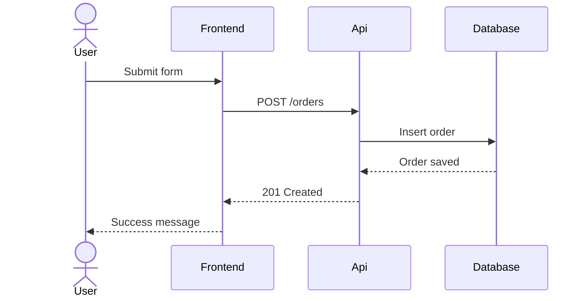
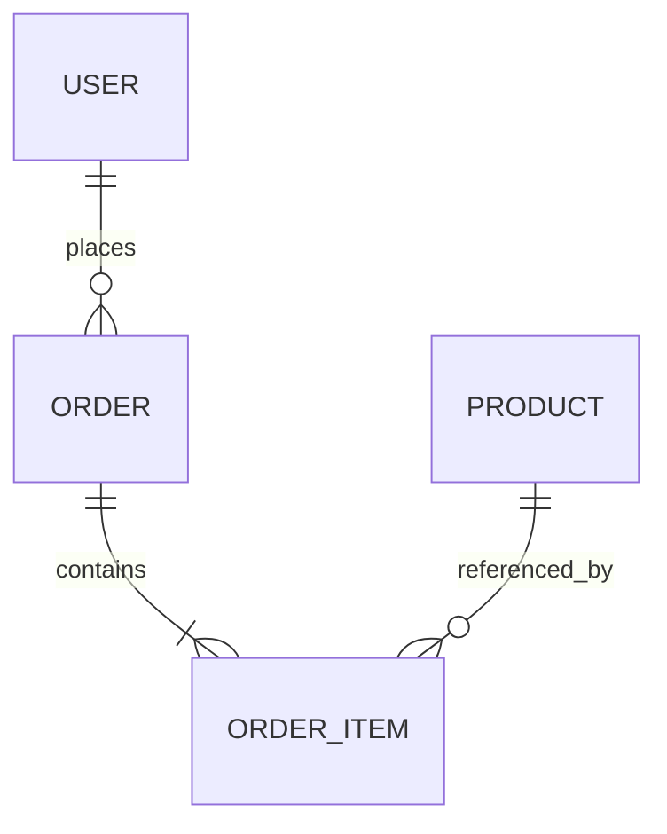

# Mermaid

A skill for producing valid, readable Mermaid diagrams based on official Mermaid syntax references bundled with this skill.

## When to use

Use this skill whenever the user wants any of the following:

- a Mermaid diagram
- a diagram expressed in markdown
- a flowchart, sequence diagram, ERD, class diagram, state diagram, gantt, pie chart, timeline, journey, C4, architecture, mindmap, sankey, radar, quadrant chart, block diagram, packet diagram, treemap, tree view, venn, requirement diagram, git graph, or similar structured visual
- an existing Mermaid diagram fixed, simplified, reformatted, debugged, or explained
- another format converted into Mermaid
- Mermaid syntax checked against official documentation
- a visually cleaner or more maintainable Mermaid diagram

Use this skill even if the user does not explicitly say “Mermaid” but is clearly asking for a textual diagram format suitable for markdown, docs, repos, wikis, or architecture notes.

## Goals

For every Mermaid response, aim for all of the following:

- syntactically valid Mermaid
- the correct diagram type for the task
- high readability
- minimal unnecessary complexity
- stable naming and structure
- easy copy-paste usability

## Core behavior

Follow this workflow:

1. Identify the best Mermaid diagram type for the user’s intent.
2. Read only the relevant reference file(s) from `references/` or `syntax/`.
3. Produce a valid Mermaid diagram using the official syntax style for that diagram family.
4. Keep labels concise and readable.
5. Avoid mixing syntax from different Mermaid diagram types.
6. If the input Mermaid is broken, repair it before optimizing it.
7. If the user’s request is ambiguous, make the most reasonable diagram choice and proceed.
8. Prefer a simple correct diagram over a clever complicated one.

## Output rules

### Default output
When the user asks to generate or fix a diagram, return a Mermaid fenced code block unless they explicitly ask for explanation only.

Use this format:

```mermaid
flowchart TD
  A[Start] --> B[End]
````

### Surrounding text

Keep surrounding explanation short unless the user asked for deeper explanation.

### When user asks for debugging

If the user pasted broken Mermaid:

* return the corrected Mermaid
* briefly say what was wrong
* do not over-explain unless asked

### When user asks for explanation

If the user wants explanation rather than generation:

* explain the diagram structure clearly
* include corrected Mermaid if useful

## Diagram type selection

Choose the most appropriate diagram type

## Diagram writing principles

### Readability first

Prefer:

* short labels
* consistent node naming
* fewer crossing lines
* logical top-down or left-right flow
* grouped concepts
* meaningful edge labels only when useful

Avoid:

* giant dense diagrams
* overly long labels inside nodes
* decorative complexity
* duplicating the same concept multiple times unless clarity requires it

### Stable identifiers

When a syntax requires identifiers, use stable simple identifiers such as:

* `User`
* `Api`
* `Database`
* `Start`
* `ValidateInput`

Avoid random or noisy IDs.

### Label style

Prefer human-readable labels in brackets or quotes where supported. Keep them concise.

### Complexity control

For large systems:

* compress repeated details
* show the most important entities first
* omit implementation trivia unless requested
* split conceptual levels mentally before writing the final diagram

If a user asks for a huge architecture, produce the most useful single view rather than trying to encode every detail.

## Repair rules for invalid Mermaid

When fixing Mermaid:

1. Preserve the user’s meaning.
2. Correct invalid syntax with minimal semantic change.
3. Normalize spacing and indentation.
4. Remove unsupported constructs for the chosen diagram type.
5. Replace mixed or cross-type syntax with valid equivalent syntax.
6. If the user chose the wrong diagram type, silently switch only if necessary to make the result valid and clearer.

Common issues to watch for:

* wrong diagram keyword
* mixed syntax from flowchart/class/ERD/etc.
* invalid arrows
* invalid subgraph or block nesting
* unsupported styling syntax in that diagram type
* labels with unescaped problematic characters
* malformed notes, relationships, or declarations
* version-specific features used in the wrong context

## Conversions

If converting to Mermaid from plain text, bullets, pseudo-code, or architecture notes:

1. infer the underlying structure
2. choose the right diagram type
3. preserve the important relationships
4. simplify where needed for readability

If converting from one Mermaid diagram type to another:

* preserve meaning over exact shape
* use idiomatic syntax for the target type
* do not mechanically translate invalid structures

## Reference files

Consult the relevant bundled syntax references before generating or repairing diagrams.

Primary references live under: [Syntax References](./syntax-references.md)

Read only the files relevant to the user’s requested diagram type. Do not load everything unless necessary.

## Preferred response patterns

### Pattern: generate new diagram

Use when the user asks for a diagram from scratch.

Steps:

1. infer the right type
2. generate valid Mermaid
3. keep explanation minimal

### Pattern: fix existing Mermaid

Use when the user pastes Mermaid that errors or renders badly.

Steps:

1. inspect type and syntax
2. correct invalid constructs
3. return fixed Mermaid
4. briefly mention key fixes

### Pattern: improve readability

Use when the user’s Mermaid is technically valid but messy.

Steps:

1. preserve semantics
2. reduce clutter
3. normalize naming
4. improve layout direction where useful
5. return cleaner Mermaid

### Pattern: explain diagram

Use when the user asks what a diagram means.

Steps:

1. explain entities and relationships
2. point out flow or lifecycle
3. mention any syntax or modeling oddities if relevant

## Constraints

* Never invent unsupported syntax when official Mermaid syntax already covers the task.
* Never mix two diagram grammars in one block.
* Do not add commentary inside the Mermaid block unless the syntax supports it.
* Do not pad the answer with unnecessary prose.
* Do not output pseudo-Mermaid.
* If Mermaid is a poor fit for the request, say so briefly and provide the closest sensible Mermaid alternative.

## Quality checklist

Before finalizing, check:

* Is the chosen diagram type correct?
* Is the syntax internally consistent?
* Is the diagram copy-paste ready?
* Are labels readable?
* Is there unnecessary complexity to remove?
* Did I avoid mixing unsupported constructs?

## Examples

### Example 1: simple flowchart

User intent: show a login flow

```mermaid
flowchart TD
  A[User opens app] --> B{Logged in?}
  B -- Yes --> C[Show dashboard]
  B -- No --> D[Show login form]
  D --> E[Submit credentials]
  E --> F{Valid?}
  F -- Yes --> C
  F -- No --> G[Show error]
```

### Example 2: sequence diagram

User intent: API request lifecycle



### Example 3: ER diagram

User intent: basic ecommerce schema


